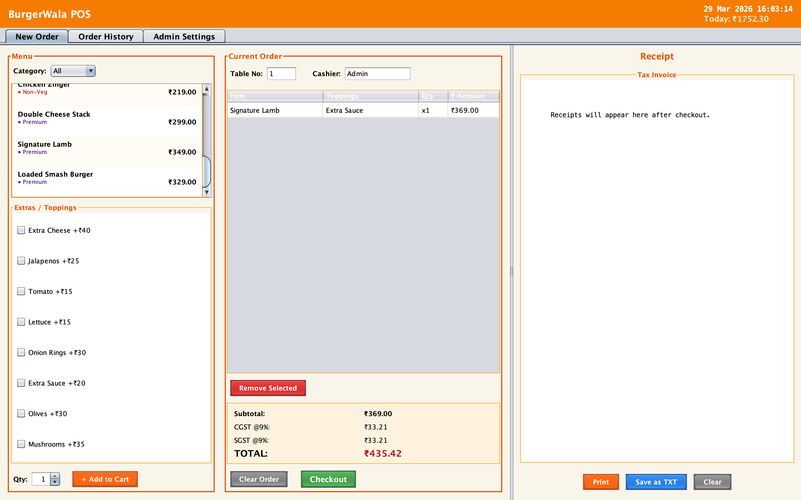
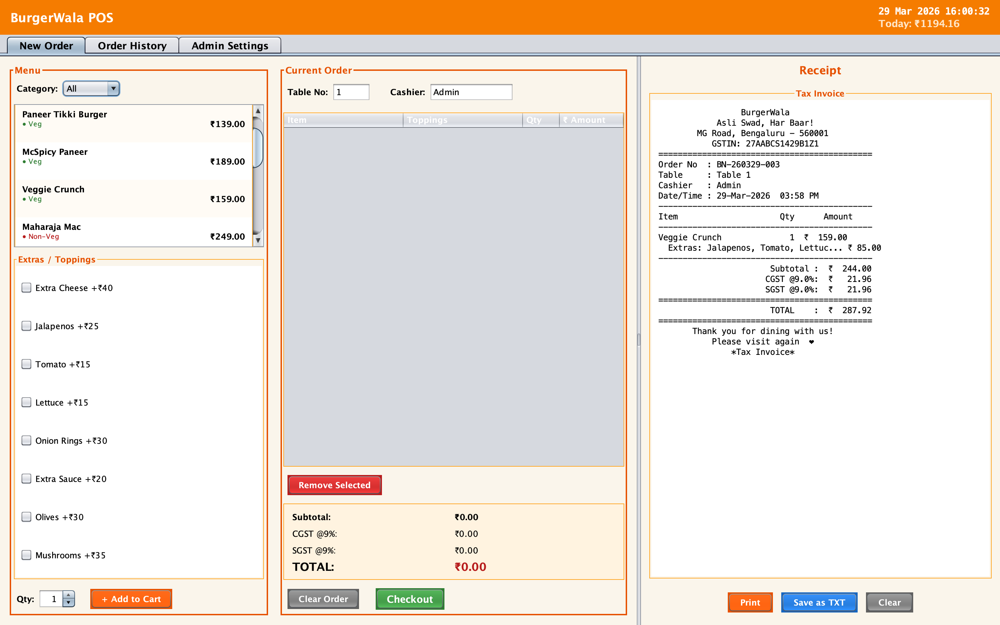
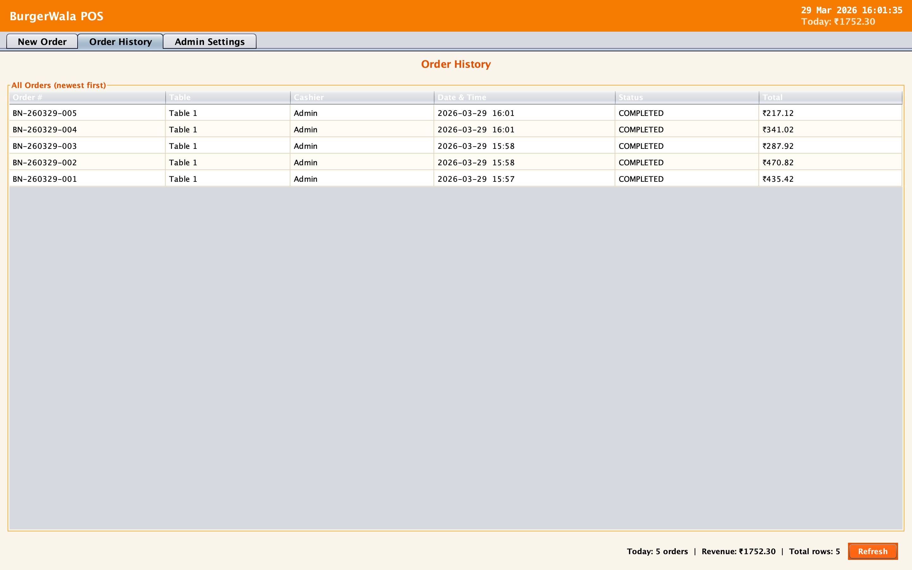
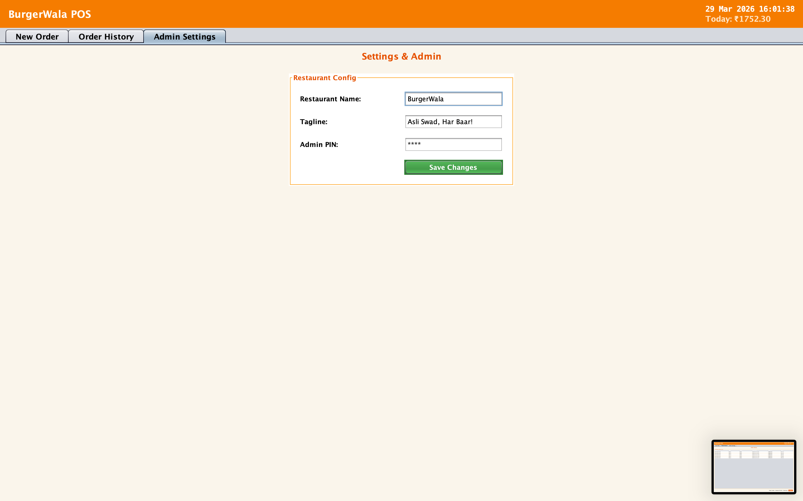

# 🍔 BurgerWala POS System

## Project Title
**BurgerWala Point of Sale (POS): A Production-Ready Restaurant Billing Solution**

## Problem Statement
The original application was a basic, hardcoded college assignment demonstrating a simple McDonald's ordering flow for a single burger. The primary objective of this project was to upgrade that basic simulation into a fully functional, robust, and mathematically sound Point of Sale (POS) system ready for real-world deployment in an Indian AC restaurant context. 

The upgraded system needed to dynamically manage a multi-item cart, compute accurate Indian GST metrics (9% CGST + 9% SGST), preserve data across sessions natively natively using SQLite, recall historical order data for basic analytics, issue literal tax invoices digitally/physically, and safeguard global properties behind an administrator PIN.

## Tools and Technologies Used
*   **Java 8+ (Core)**: Primary application logic, object-oriented models, and math computations.
*   **Java Swing (Nimbus LAF)**: The native Graphical User Interface (GUI) framework utilized for creating the interactive tabbed menus, JTables, and forms.
*   **SQLite (JDBC)**: Lightweight, file-based relational database used for persisting orders, transactions, and session items automatically in `burgernama.db`.
*   **Java Print API**: Native hardware integration library for securely funneling rendered text invoices to physical desktop printers.
*   **Event Listeners**: Utilized custom Callback interfaces to cleanly parse state between loosely coupled UI panels.

## Installation Steps
1. **Ensure Prerequisites**: Verify you have the **Java Development Kit (JDK 8 or higher)** installed on your machine.
2. **Clone Repository**:
   ```bash
   git clone https://github.com/muhammedali/Restaurant-Billing-System-java-swing.git
   cd Restaurant-Billing-System-java-swing
   ```
3. **Database Setup**: No manual configuration is required. The system will automatically construct `burgernama.db` and initialize the proper schema on first launch.

## Execution Procedure
To run the BurgerWala POS logic from your terminal:
1. Navigate to the source folder:
   ```bash
   cd src
   ```
2. Compile all `.java` application files:
   ```bash
   javac *.java
   ```
3. Launch the App:
   ```bash
   java App
   ```

*(Alternatively, you can open the project root in an IDE like IntelliJ IDEA or Eclipse and run `App.java` directly.)*

## Output Screenshots
*(Please capture and place your screenshots in an adjacent `docs/` folder, then link them below for your final submission presentation.)*

*   **New Order Checkout Flow**:
    
*   **Receipt Verification**:
    
*   **Historical Data Tracking**:
    
*   **Admin Configurations**:
    

## Conclusion
This refactor successfully bridged the gap between a foundational educational assignment and a viable, production-grade enterprise concept. By normalizing data inside an SQLite engine, overhauling the GUI cleanly into categorized tabs, and incorporating strict financial compliance (18% GST tracking), the BurgerWala POS system securely demonstrates the core pillars of transactional business software.
